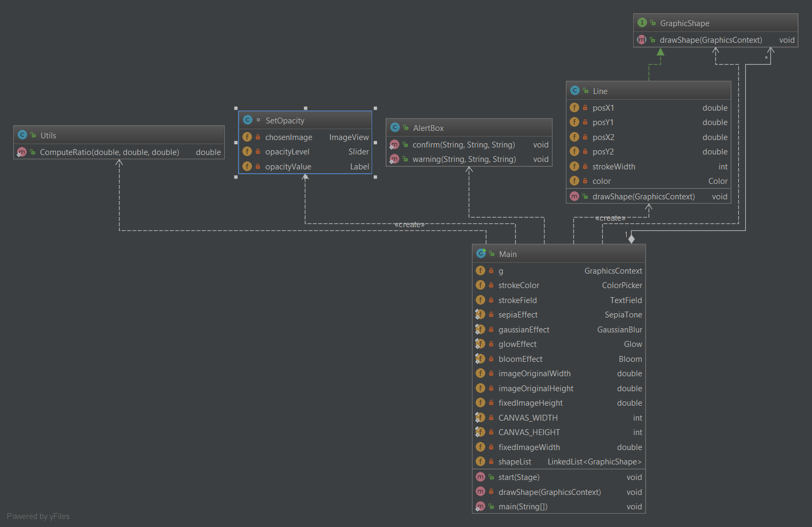
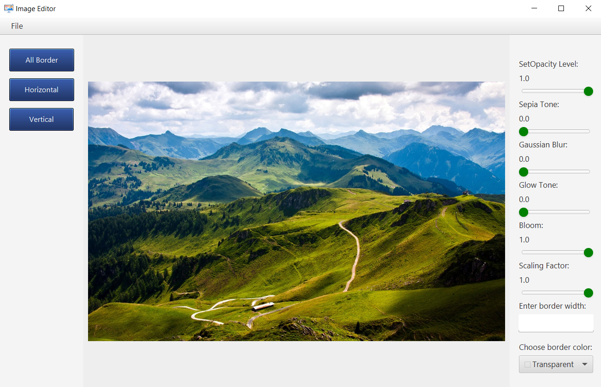
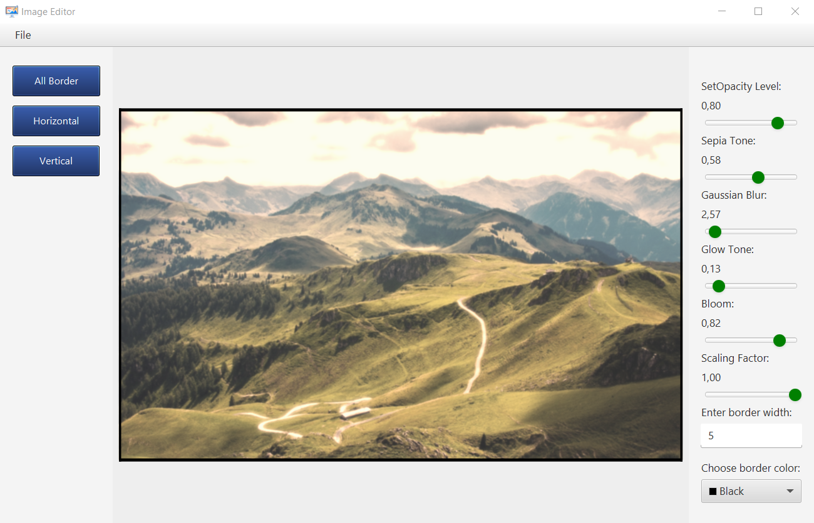

# Image Editor

This project was developed as a laboratory work on Software Engineering, but later grew into a unique project that contains a primitive implementation of a image editor, that developed using JavaFX.

## Prerequisites

1. [IntelliJ IDEA](https://www.jetbrains.com/idea/download/#section=windows)
2. [Basic knowledge in Design Patterns](https://refactoring.guru/design-patterns)

## Functionality
The image editor contains the following effects for working with images:

- [x] Sepia Tone
- [x] Gaussian Blur
- [x] Glow
- [x] Bloom

Other features include:

- [x] Opacity Level
- [x] Scaling Factor
- [x] Choice of color of filling of a figure
- [x] Canvas cleaning
- [x] Saving work results
- [x] Open images
- [x] Adjust borders (horizontal/vertical) and their color for the image
- [x] Removing borders

In general, everything is based on the `Composite`, `Prototype` and `Visitor` patterns.

  
Class Diagram

    

## Example of project performance

    

    

    

